# Segway Pilot SDK (Alpha版预览)
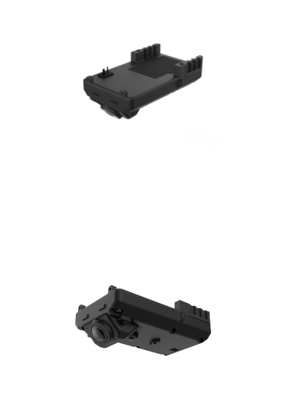
一套支持在Segway Pilot上开发、部署AI模型的SDK。

# 一、SDK Flow Path
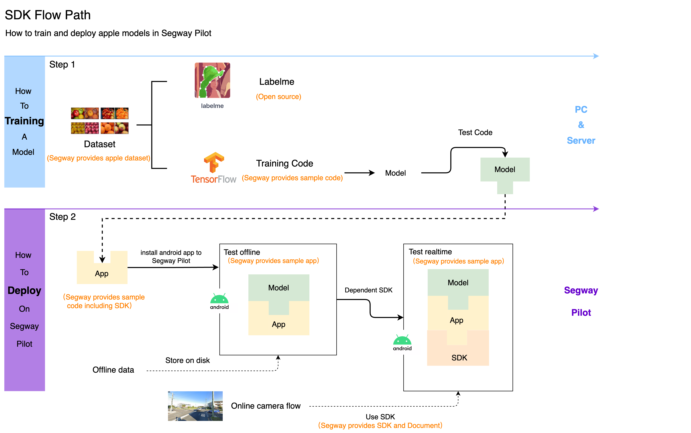

# 二、Segway Pilot实体开发套件（只限客户）
## 1. 实体开发套件内容
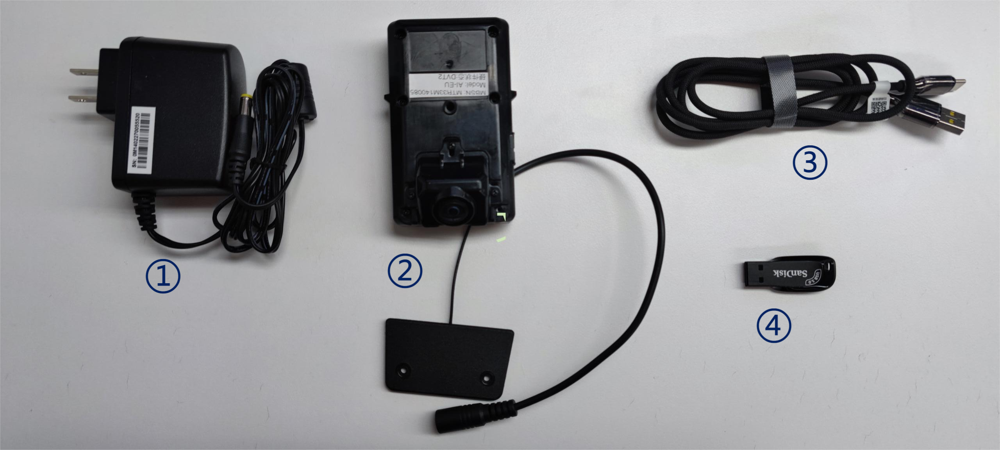

|序号|内容|数量|用途|
|:-----:|:-------:|:------:|:------:|
|1|电源|1|用于Segway Pilot设备供电|
|2|Segway Pilot|1|搭载Android平台的硬件设备|
|3|Type-c 数据线|1|可连接电脑和设备进行调试|
|4|32G U盘|1|内置数据集、环境搭建软件、部分文档说明|
## 2. U盘内容
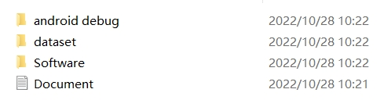  
|序号|内容|作用|
|:-----:|:-------:|:------:|
|1|android debug|Segway Pilot调试工具|
|2|dataset|苹果数据集（已标注）|
|3|Software|环境搭建软件|
|4|Document|github地址|


# 三、训练一个苹果检测AI模型(以Ubuntu为例)
> 下面以训练、部署苹果分类模型为例，示范完整开发、部署流程。

## 1. Labelme标注软件
开源标注软件地址: https://github.com/wkentaro/labelme  
> 苹果数据集已经标注完毕，可以直接使用，数据在U盘dataset目录下。


## 2. AI模型训练环境搭建（基于Tensorflow）
### **a. 安装miniconda**  
在Terminal中，逐⾏输⼊命令： 
```
wget https://repo.anaconda.com/miniconda/Miniconda3-latest-Linux-x86_64.sh  
chmod +x Miniconda3-latest-Linux-x86_64.sh  
./Miniconda3-latest-Linux-x86_64.sh  
```
若安装成功将提示：“Thank you for installing Miniconda3!”。

### **b. 创建训练环境** 
在Terminal中，逐⾏输⼊命令：  
> reqiurement.txt在工程根目录下
```  shell  
conda create -n sidewalk_perception python==3.6.13
conda install tensorflow-gpu==1.12.0
pip install -r requirement.txt
```  

### **c. 安装cuda**  
Nvidia cuda官方下载地址（可以根据实际系统版本选择对应Toolkit版本）：
https://developer.nvidia.com/cuda-downloads  

其他安装cuda教程参考:   
https://towardsdatascience.com/deep-learning-gpu-installation-on-ubuntu-18-4-9b12230a1d31

### **d. 下载安装vscode编译器** 
vscode官方地址: https://code.visualstudio.com/  
```
// 安装vscode  
sudo dpkg -i code_1.62.0-1635954068_amd64.deb 
// 打开vscode  
code ./xx
```

## 3. 训练一个苹果目标检测模型
### **a. 按数据集格式分配数据**
将标注人员提交的数据按照2：8分成。
```
└── data
    ├── train
    └── test
```

### **b. 生成tfrecord**
将上一步骤分好的数据集复制到工程下（需要先进行解压）。修改下面文件中的`data_dir`（`data_dir`是数据集train文件夹路径）、`output_path`参数的路径值并运行，数据集相应的.tfrecord文件将会生成在`output_path`所写的文件夹下。
```
dataset_tools/generate_apple_dataset.sh
#!/bin/sh
workspace=$(cd "$(dirname "$0")";pwd)
python $workspace/create_apple_tf_record.py \
    # data_dir 填写数据集下train文件夹路径
    --data_dir '/raid/data/object_detect/Apple_221019/train' \
    --from_database 0 \
    --data_family 'original' \
    # output_path 填写输出tfrecord路径
    --output_path './tf_record/Apple_221019/20221019' \
    --visual_dir './visualization' \
    --tfrecord_width 512 \
    --tfrecord_height 512
```

### **c. 训练**
i. 修改下面文件中的`# change`参数，根据实际数据集路径情况自行修改。  
```
config/train.yaml
# change
data_dir: "./tf_record/Apple_221019/"

# change
exp_dir: "./models/experiment-AiBox-Apple-model-mbv1-0.25-20221102/"
```
ii. 在终端输入下列代码，即可训练。
``` 
python train.py
```

### **d. 生成.tflite文件**
修改`generate-tflite-float-model.sh`文件中的： 
``` 
--input_checkpoint
--output_graph

--output_file
--graph_def_file
```
`generate-tflite-float-model.sh` 文件内容
```
export CUDA_VISIBLE_DEVICES='2'

freeze_graph \
  --input_graph=./models/experiment-AiBox-Apple-model-mbv1-0.25-20221017-num1/graph_eval.pbtxt \
  --input_checkpoint=./models/experiment-AiBox-Apple-model-mbv1-0.25-20221019/model.ckpt-571130 \
  --output_graph=./best_distillation_float_model_folder/frozen_eval_apple_graph-571130.pb \
  --output_node_names=head/reg13x13_output/BiasAdd,head/reg26x26/BiasAdd,head/reg52x52/BiasAdd
echo "freeze graph done."

tflite_convert \
  --output_file=./best_distillation_float_model_folder/frozen_eval_apple_graph-571130.tflite \
  --graph_def_file=./best_distillation_float_model_folder/frozen_eval_apple_graph-571130.pb \
  --input_arrays=Placeholder \
  --output_arrays=head/reg13x13_output/BiasAdd,head/reg26x26/BiasAdd,head/reg52x52/BiasAdd
echo "tflite convertion done."
```
在终端输入下方指令即可在相应文件夹生成`.tflite`模型文件,之后便可以在app中通过C++代码调用此`.tflite`进行实时预测图像目标数据。
```
sh ./generate-tflite-float-model.sh
```

### **e. 验证**
修改`config/inference.yaml`中的`# change`下的参数,根据实际训练情况自行修改。  
```
config/train.yaml
# change
tflite_mode_path: "./best_distillation_float_model_folder/frozen_eval_apple_graph-571130.tflite"

# change
test_img_folder: "/raid/data/object_detect/Apple_221019/test"

# change
output_dir : "./result_apple"
```
输入下方指令运行模型验证，在`result_apple/`中查看测试结果图片。
```
./inference.sh
```


# 四、部署苹果检测AI模型到Segway Pilot(以Windows为例)
## 1. Android开发环境搭建
### **a. 下载安装jdk-1.8.0_311、配置环境变量**
i. 安装jdk软件  
方式一:  
在U盘software文件内找到jdk-8u311-windows-x64.exe安装包。  
方式二：  
在jdk官方网站进行下载,下载地址：
https://www.oracle.com/java/technologies/downloads/#license-lightbox

ii. 配置环境变量  
(1) 打开windows环境变量，创建JAVA_HOME变量，下方填写jdk安装位置。
```
Variable Name: JAVA_HOME
Variable Value: jdk install location (such as: C:\Program Files\Java\jdk1.8.0_311)
```
(2) 在系统环境变量path中添加以下两项
```
Variable Name: PATH 
Variable Value: %JAVA_HOME%\bin;%JAVA_HOME%\jre\bin
```
(3) 点击应用、确定，关闭窗口。  
(4) 打开cmd，输入java -version确定jdk是否生效，看到下图说明配置成功。
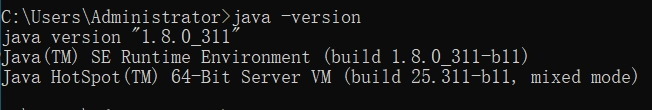

### **b. 下载Android Studio(4.0.2)**
i. 方式一：  
在U盘software文件内找到android-studio-ide-193.6821437-windows.exe安装包,点击安装。  
ii. 方式二：  
在Android官方网站进行下载4.0.2版本，下载地址：
[Download Android Studio & App Tools - Android Developers](https://developer.android.google.cn/studio)

### **c. 安装Android Studio(4.0.2)**
点击安装，下一步，直到安装完成。
> 点击Tools -> SDK Manager -> SDK Tools  
> 点击右下角“Show Package Details”，选中NDK一项（version is 16.1.447），选中CMake一项（version is 3.6.4），点击“Apply”开始安装。 

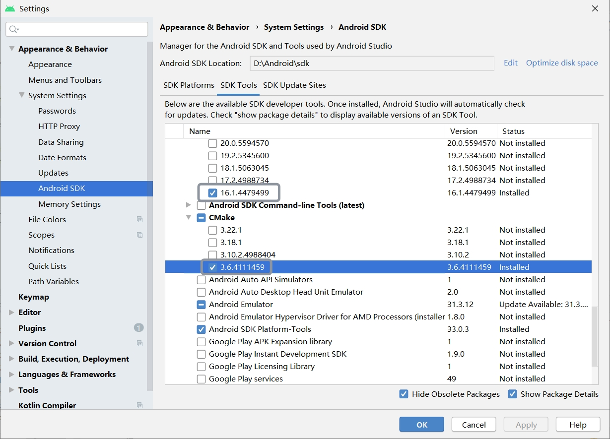 
## 2. 导入并使用Sample App工程
### **a. 导入SampleProject**
i. clone 代码
```
git clone https://github.com/SegwayRoboticsSamples/AIBoxSample.git
```
ii. 使用Android Studio打开示例工程项目  
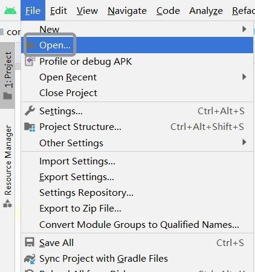

### **b. 编译工程**
若导入工程代码编译失败，提示`NDK not configured`。  
i. 参考上方Android Studio下载安装NDK。    
ii. 从安装目录找到NDK路径，填写到工程根目录`local.properies`文件下。参考代码：
```
ndk.dir=D\:\\android\\Sdk\\ndk\\16.1.447499 (将D:...改为你自己的安装路径)
```
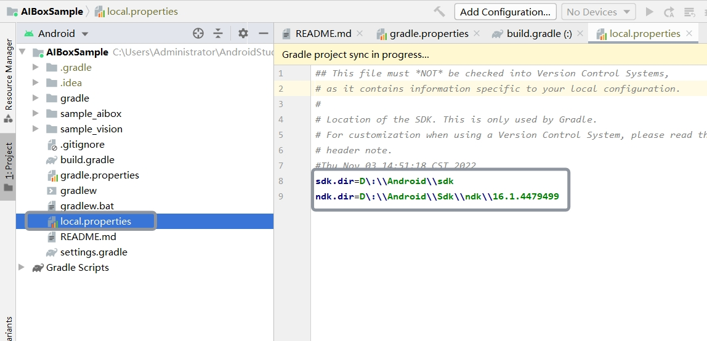  

## 3. 运行AIBoxSample到Segway Pilot
请将训练好的AI模型命名为`apple_model.tflite`并`adb push`到`sdcard/slam_config/`目录下。
``` 
adb push apple_model.tflite sdcard
```
离线检测苹果需将以`apple.jpeg`命名的苹果图片`adb push`到`sdcard/`目录下。
```
adb push apple.jpeg sdcard
```
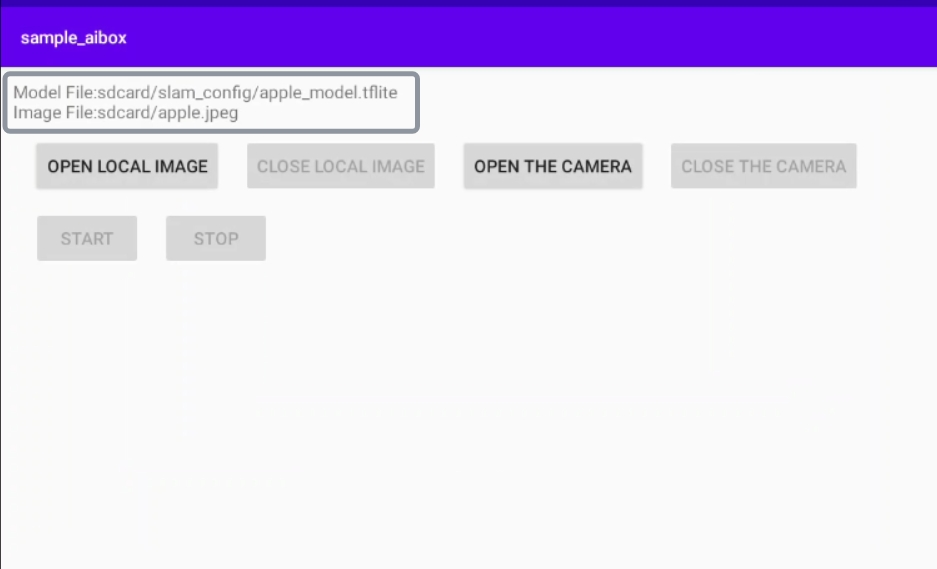  
### **a. 使用adb和scrcpy调试Segway Pilot**  
adb以及scrcpy程序在U盘android debug文件夹下，可直接使用。  
> tips：  
> (1) 请在使用前配置adb系统环境变量。  
> (2) scrcpy官方地址：https://github.com/Genymobile/scrcpy
### **b. 使用图像离线进行苹果检测**
> 离线检测苹果需将以`apple.jpeg`命名的苹果图片`adb push`到`sdcard/`目录下。  

点击OPEN LOCAL IMAGE按钮，再点击START即可开启模型，进行离线检测苹果，被检测出的苹果将显示绿色边框。
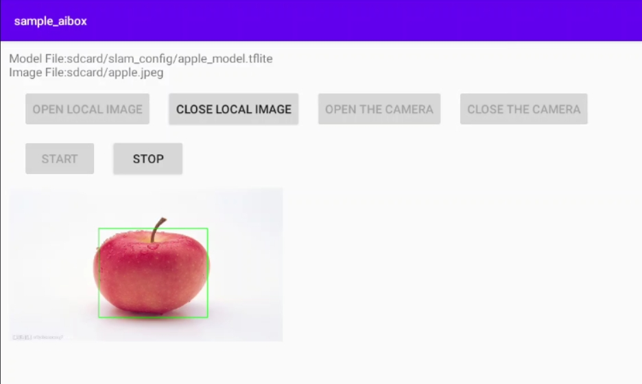
### **c. 实时进行苹果检测**
点击OPEN THE CAMERA按钮，再点击START即可开启模型，使用相机进行实时检测苹果，被检测出的苹果将显示绿色边框。
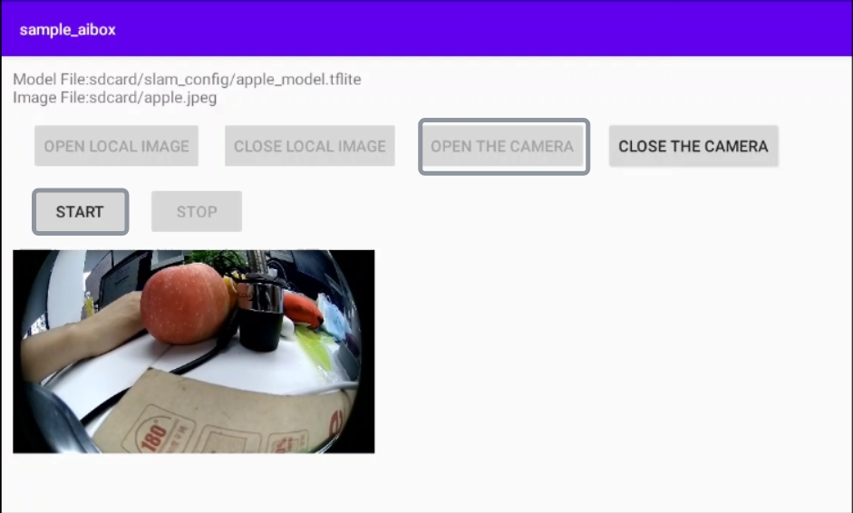
# 五、常见问题

1. 如果`git clone`时提示`...path filename too long`，可以在Terminal中输入以下命令解决此问题。
    ```
    git config --system core.longpaths true
    ```

2. 运行sample_aibox出现`Invalid keystore format`错误的解决办法。  
关闭AndroidStudio，删除`C:/Adm.../.android`文件夹，然后重新打开Andorid Studio重新生成keystore文件。

# 六、开源许可
Apache 2.0